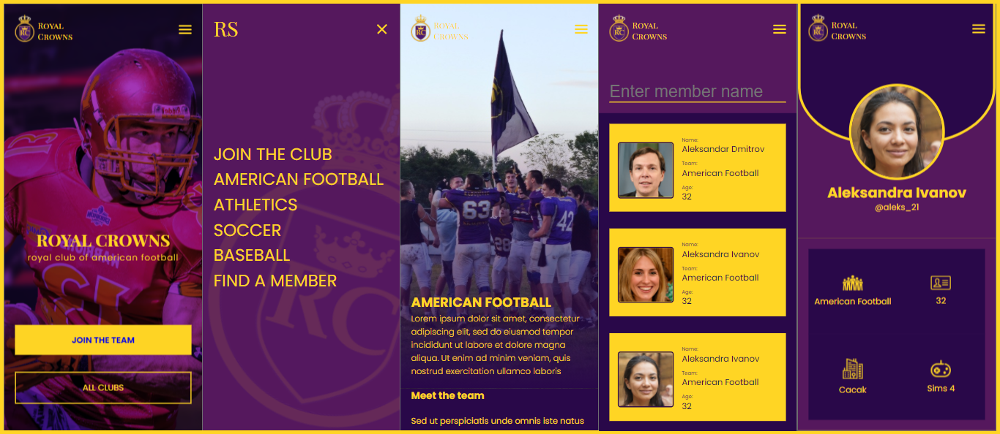

<a href="http://odsrca.rf.gd/"><h1>Royal Crowns</h1></a>
<h2>Project Overview</h2>

The project is a reimagination of the local sports club "Royal Crowns" <a href="http://kraljevskekrune.weebly.com/">website</a>.
   The reason for there not being a tablet and desktop version is that I wanted to learn React Router and implement a search by name function in the "Find a member" page. After doing so,
    I deemed it not to be important to complete the rest of the website as this is just a learning project.

 

<h2>Design</h2>

The colors chosen for the website are inspired by the official colors of the team:

<ul>
    <li>Dark Purple (#290849)</li>
    <li>Light Purple (#55185D)</li>
    <li>Dark Yellow(#ECB602)</li>
    <li>Light Yellow(#FFD524)</li>
</ul>

The Figma design can be found <a href="https://www.figma.com/file/Qt6dEoOavicSLNz7yfrgTV/Royal-Crowns-Kraljevo?node-id=0%3A1">here</a>.

<h2>Technologies</h2>

For this project the following tecnologies were used:

<ul>
    <li>
HTML - Used to create the markup of the page.

    </li>
        <li>
SASS/CSS - Sass was used in order to streamline and simplify the styling of the page.

    </li>
        </li>
        <li>
ReactJS - This framework was useful to more easily create sections and components of the website.

    </li>
    <li>
React Router - React Router was used to dynamically create club pages and member profiles, as well as to increase page loading times.

    </li>

</ul>
